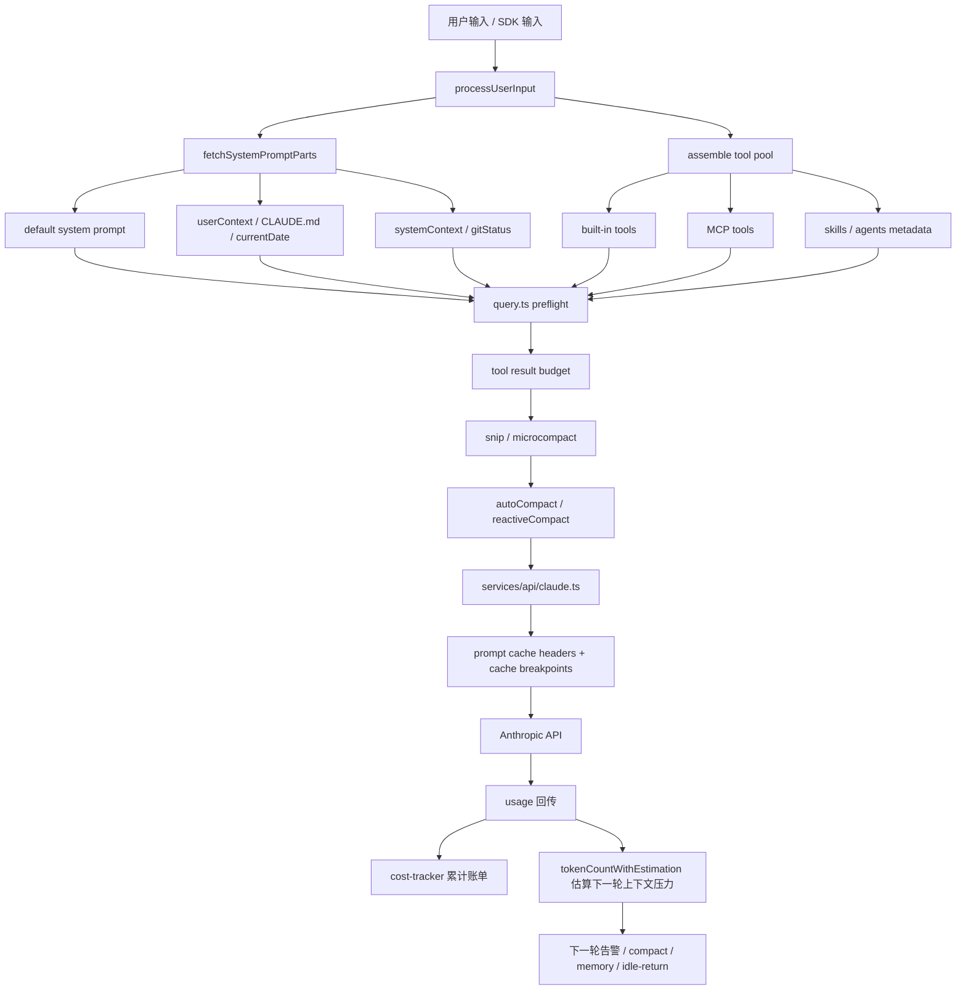
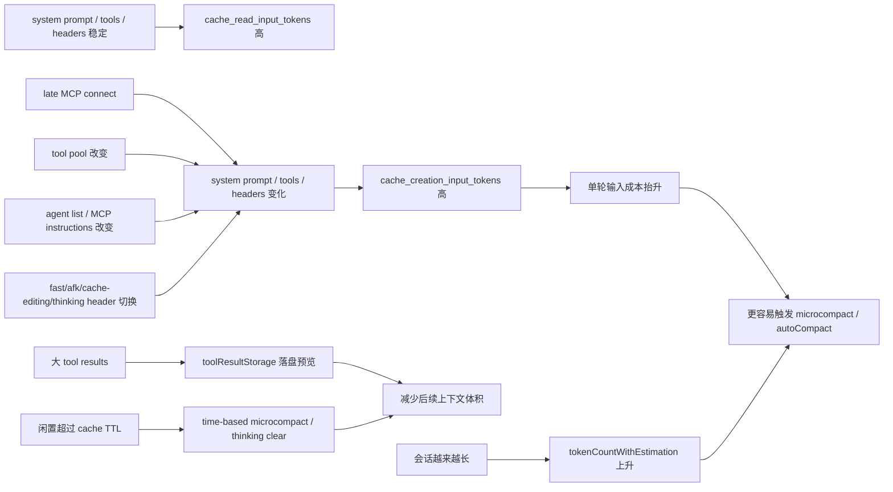

# Claude Code Token 消耗分析

这份说明基于 `03-claude-code-runnable` 当前源码整理，目标不是解释通用 LLM 计费概念，而是回答这个项目里 4 个更实际的问题：

1. token 在这套运行时里到底是怎么统计的
2. 一次请求的 token 主要花在哪些位置
3. 项目里已经做了哪些压缩和 prompt cache 保护
4. 如果要继续优化，应该优先改哪里

## TL;DR

- 这套代码里至少同时维护了两套 token 口径：`当前上下文压力` 和 `累计账单使用量`，它们不是一回事。
- 真正推高 token 的，通常不是用户一句话本身，而是每轮都会重发的系统提示词、工具 schema、MCP/skills/agents 元数据、历史消息、tool results 和附件。
- 代码里已经实现了多层节流：`prompt cache` 稳定化、`microcompact`、`autoCompact`、大结果落盘、相关记忆注入上限。
- 如果 prompt cache 失效，单轮成本会突然上升很多，因为系统前缀和工具前缀要整段重写。
- 多 agent 会增加总消耗，但 fork/subagent 路径专门做了 cache-sharing，设计目标不是线性翻倍。

## 1. 两套 token 口径

| 口径 | 主要函数 | 含义 | 典型用途 |
|---|---|---|---|
| 当前上下文压力 | `src/utils/tokens.ts` 里的 `tokenCountWithEstimation()` | 估算“下一次请求发给模型时，上下文大概有多大” | autocompact、session memory、context 分析、阈值告警 |
| 最近一次 API 响应总量 | `src/utils/tokens.ts` 里的 `getTokenCountFromUsage()` | `input_tokens + cache_creation_input_tokens + cache_read_input_tokens + output_tokens` | 从真实 usage 反推最近一轮窗口大小 |
| 会话累计账单量 | `src/cost-tracker.ts` + `src/bootstrap/state.ts` | 按模型累计输入、输出、cache read、cache write | `/cost`、状态栏、统计、告警 |

需要特别注意：

- `tokenCountWithEstimation()` 是“上下文压力”的核心口径，不是累计账单。
- `getTotalInputTokens()` 只累计 `inputTokens`，不包含 cache read / cache creation。
- 会话级账单展示会把 `input`、`output`、`cache read`、`cache write` 分开统计。

源码落点：

- `src/utils/tokens.ts`
- `src/cost-tracker.ts`
- `src/bootstrap/state.ts`

## 2. 一次 Claude Code 请求里，token 都花在哪

可以把一次主循环请求近似理解成：

```text
总请求 token
= system prompt
+ userContext / systemContext
+ tools schema
+ MCP / skills / agents 元数据
+ 历史消息
+ tool results / attachments
+ thinking
+ 本轮输出
```

### 2.1 System prompt 和上下文前缀

`QueryEngine` 会先通过 `fetchSystemPromptParts()` 取三块内容：

- `defaultSystemPrompt`
- `userContext`
- `systemContext`

然后再拼成最终 `systemPrompt`。

这里面最容易被低估的是 `userContext` 和 `systemContext`：

- `userContext` 会注入 `CLAUDE.md` 相关内容和当天日期
- `systemContext` 会在允许时注入 git status、branch、recent commits 等环境信息

源码落点：

- `src/utils/queryContext.ts`
- `src/context.ts`

### 2.2 工具 schema

Claude Code 不是只发消息，它会把当前可用工具一并发给模型。工具集合由下面几层组合：

- built-in tools
- MCP tools
- REPL/simple/coordinator 模式下的过滤结果
- feature gate 打开的额外工具

这意味着工具越多，尤其是 MCP tools 越多，系统前缀越大。

源码落点：

- `src/tools.ts`
- `src/Tool.ts`

### 2.3 Skills、插件、Agent 元数据

命令系统并不只是“给人用的 `/命令`”，很多 skill/frontmatter 元数据也会进入模型可见面。

这部分成本主要来自：

- skill frontmatter 的 `description`、`when_to_use`、`allowed-tools`
- plugin skills
- built-in/bundled skills
- agent list 和 agent prompt 说明
- MCP instructions

源码里甚至明确写了一个案例：动态 agent 列表曾占到明显比例的 cache creation tokens，所以后来支持把 agent list 改成 attachment 形式，避免直接嵌进 tool description。

源码落点：

- `src/commands.ts`
- `src/skills/loadSkillsDir.ts`
- `src/tools/AgentTool/prompt.ts`
- `src/constants/prompts.ts`

### 2.4 历史消息、tool results、attachments

这部分通常才是会话中后期最大的膨胀源：

- 多轮对话历史
- 大段文件读取结果
- Bash 输出
- Web fetch / web search 结果
- 图片、PDF、memory attachments
- 多工具并行时同轮堆叠的多个 `tool_result`

`tokenCountWithEstimation()` 会用“最近一次真实 usage + 后续消息粗估”方式估算当前窗口，并且专门处理了“一个 API 响应拆成多个 assistant 记录、其间夹着多个 tool_result”的情况，避免低估。

源码落点：

- `src/utils/tokens.ts`
- `src/utils/attachments.ts`
- `src/query.ts`

### 2.5 Thinking 和输出

如果 thinking 开着，模型输出里还会有 thinking block。源码里区分了：

- `adaptive`
- `enabled + budgetTokens`
- `disabled`

thinking 既影响输出 token，也影响 cache key 稳定性，因此代码里对相关 header 和清理策略做了专门处理。

源码落点：

- `src/utils/thinking.ts`
- `src/services/api/claude.ts`

## 3. 这个项目里最容易烧 token 的场景

### 3.1 长会话 + 高频工具调用

每轮都要带上：

- 前缀 system prompt
- 工具定义
- 之前的 assistant / user / tool_result

如果不 compact，窗口会越来越大。

### 3.2 大结果重复留在上下文

最典型的是：

- `Read` 大文件
- `Bash` 打出超长日志
- 多个并行工具同时返回大结果

单个结果不一定超阈值，但“同一轮多个 tool_result 累加”会把用户消息撑爆，所以代码里额外做了 message-level aggregate budget。

### 3.3 MCP server 太多

MCP 不是只占连接成本，它还会带来：

- 工具 schema
- server instructions
- MCP command / MCP skill 元数据

一旦 server 数量多，模型前缀会明显变厚。

### 3.4 动态配置导致 prompt cache 失效

源码里很重视这个问题，因为 prompt cache 一旦 miss，前缀整段重写，token 消耗会显著上升。

典型触发因素：

- tools 集合变化
- MCP instructions 晚连接后变化
- 动态 agent 列表变化
- fast/afk/cache-editing/thinking 相关 beta header 变化
- system prompt 动态段变化

### 3.5 Thinking 开启的长工具链回合

thinking 本身增加输出，长回合里又常伴随：

- tool_use
- tool_result
- 继续追问

所以经常是放大器而不是独立成本点。

### 3.6 相关记忆、CLAUDE.md、附件持续注入

记忆注入虽然有上限，但如果会话长、任务跨度大，累计也不可忽视。

源码中相关上限：

- 单个 memory 文件最多 `200` 行
- 单个 memory 文件最多 `4096` 字节
- 单个 session 累计 surfacing 最多 `60 * 1024` 字节

源码落点：

- `src/utils/attachments.ts`

## 4. 项目里已经做了哪些 token 控制

## 4.1 Context window 与阈值

关键常量：

- 默认 context window：`200_000`
- 某些模型/实验路径可到 `1_000_000`
- compact 摘要预留输出：最多 `20_000`
- autocompact buffer：`13_000`
- warning / error threshold buffer：`20_000`
- manual compact buffer：`3_000`

`autoCompact` 的核心思路不是“满了再压”，而是提前留出输出空间和手动干预空间。

源码落点：

- `src/utils/context.ts`
- `src/services/compact/autoCompact.ts`

## 4.2 Prompt cache 稳定化

这是项目里最重要的成本优化之一。

### 4.2.1 System prompt 动静分界

`SYSTEM_PROMPT_DYNAMIC_BOUNDARY` 把 system prompt 拆成：

- 静态、可全局缓存的前缀
- 动态、按 session 变化的后缀

这样不是每次动态信息变化都让整个系统提示词前缀失效。

源码落点：

- `src/constants/prompts.ts`
- `src/utils/api.ts`

### 4.2.2 Sticky-on header latches

源码里对几类会影响 cache key 的 beta/header 做了 session 级 latch：

- AFK mode
- fast mode
- cached microcompact 的 cache-editing header
- thinking-clear header

原因很直接：如果它们在 session 中途来回切换，会直接导致 prompt cache key 抖动。

源码落点：

- `src/bootstrap/state.ts`
- `src/services/api/claude.ts`

### 4.2.3 Fork / subagent cache sharing

forked agent 明确要求继承与父请求一致的 cache-critical params：

- system prompt
- userContext
- systemContext
- tools
- model
- messages prefix
- thinking config

这就是为什么源码里反复强调“fork 很便宜，但不要给 fork 改 model”。

源码落点：

- `src/utils/forkedAgent.ts`
- `src/tools/AgentTool/prompt.ts`
- `src/services/compact/compact.ts`

## 4.3 Microcompact / Snip / AutoCompact / ReactiveCompact

这套项目不是只有一个 compact，而是分层处理：

- `snipCompact`: 先裁掉可安全裁减的旧内容
- `microCompact`: 更细粒度地清理旧 tool results
- `autoCompact`: 达到阈值后自动总结压缩
- `reactiveCompact`: 遇到 prompt-too-long 等异常时再救火

其中 `microCompact` 又分两类：

- cached microcompact
- time-based microcompact

time-based microcompact 的默认思路是：如果离上次主线程 assistant 已超过 `60` 分钟，说明服务端 1h cache 基本已经过期，提前清理老 tool result，减少这次整段重写的体积。

源码落点：

- `src/query.ts`
- `src/services/compact/microCompact.ts`
- `src/services/compact/autoCompact.ts`
- `src/services/compact/reactiveCompact.ts`
- `src/services/compact/timeBasedMCConfig.ts`

## 4.4 大结果落盘与聚合预算

这是另一个非常实用的优化。

### 4.4.1 单工具结果阈值

默认单个 tool result 超过 `50_000` 字符时，会持久化到磁盘，再把“文件路径 + preview”给模型，而不是把完整结果塞进上下文。

### 4.4.2 单条用户消息聚合阈值

即使每个 tool result 都没超阈值，如果一轮并行工具太多，同一条用户消息里的 `tool_result` 总和超过 `200_000` 字符，也会把其中最大的若干结果落盘，直到降到预算以内。

### 4.4.3 Preview 尺寸

落盘后给模型的 preview 默认只保留前 `2000` 字节左右。

源码落点：

- `src/constants/toolLimits.ts`
- `src/utils/toolResultStorage.ts`

## 4.5 Memory surfacing 的硬上限

源码对自动记忆注入做了强限制，避免它悄悄吃掉上下文：

- `MAX_MEMORY_LINES = 200`
- `MAX_MEMORY_BYTES = 4096`
- `RELEVANT_MEMORIES_CONFIG.MAX_SESSION_BYTES = 60 * 1024`

这说明设计目标不是“尽量多塞记忆”，而是“只保留高价值、低体积的相关记忆”。

源码落点：

- `src/utils/attachments.ts`

## 5. 当前项目里，哪些数字最值得盯

如果你在看运行表现，最有价值的不是单看一个“总 token”，而是分开看：

| 指标 | 意义 | 解释方式 |
|---|---|---|
| `input_tokens` | 本轮非缓存输入 | 真实发给模型的新输入压力 |
| `cache_read_input_tokens` | 读到的缓存输入 | 高说明 cache hit 好 |
| `cache_creation_input_tokens` | 新写入缓存输入 | 高说明前缀变了、或是冷启动 |
| `output_tokens` | 模型输出 | thinking 和回答长度的直接成本 |
| `tokenCountWithEstimation()` | 当前窗口压力 | 决定 autocompact 和上下文风险 |

经验上：

- `cache_read_input_tokens` 高、`cache_creation_input_tokens` 低：通常是健康状态
- `cache_creation_input_tokens` 突然升高：通常意味着 prefix 变化、MCP 晚接入、tools 改变、header 切换，或者 session 冷了
- `output_tokens` 高但 `input_tokens` 不高：更像是 thinking 或回答过长
- `input_tokens` 和 `tool_result` 一起高：通常是历史和工具输出都在膨胀

## 6. 项目内怎么验证 token 压力

### 6.1 用 `/context`

项目里已经有上下文分析路径，不是拍脑袋估算。`/context` 和 SDK 的 `get_context_usage` 会复用 query 前的关键变换：

- compact boundary 之后的视图
- context collapse 投影
- microcompact 后的消息

所以它比单纯看原始 transcript 更接近“模型真实看到了什么”。

源码落点：

- `src/commands/context/context-noninteractive.ts`
- `src/utils/analyzeContext.ts`

### 6.2 用 `/cost`

`cost-tracker` 会记录：

- input
- output
- cache read
- cache write
- web search requests
- model 级别 usage 分解

源码落点：

- `src/cost-tracker.ts`

### 6.3 看 session 目录里的 `tool-results`

如果某些大结果被落盘，你会在 session 对应目录下看到 `tool-results/`。这说明上下文保护机制已经开始工作。

源码落点：

- `src/utils/toolResultStorage.ts`

## 7. 对这个项目最有效的优化建议

- 优先保 prompt cache 命中率，而不是只盯单轮输出长度。只要前缀不变，后续轮次通常会便宜很多。
- 控制 MCP server 数量。MCP 不只是连接开销，也会增加工具 schema 和 instructions。
- 尽量不要在长会话中频繁改变 tools、agent、output style、late MCP connect 等会扰动前缀的因素。
- 大输出不要重复读回上下文。已经落盘的结果，优先读取目标片段而不是整段重新注入。
- 任务切换明显时，优先考虑 `/compact` 或 `/clear`，不要把多个独立任务塞进一个超长 session。
- fork/subagent 适合研究类任务，但尽量保持与父会话一致的 model / tools / thinking 配置，否则会失去 cache-sharing。
- 使用 `--bare`、`--tools`、`--allowed-tools`、`--disallowed-tools` 可以在某些脚本/SDK场景下明显缩小前缀。
- 如果你在调 restored 版，先区分“token 高”是架构问题还是还原版功能不完整导致的 cache miss / fallback 行为异常。

## 8. 一个适合继续深挖的方向

如果后续要继续做更细的优化，建议按这个顺序排查：

1. 先看 `cache_creation_input_tokens` 是否异常高
2. 再看当前 session 的 tools / MCP / skills / agents 是否过多
3. 再看是否存在重复的大 tool result 注入
4. 再看 thinking 和输出长度是否过高
5. 最后才考虑调模型窗口或压缩阈值

原因是：在这套架构里，最贵的通常不是“多说了几句”，而是“让整个前缀重新失去缓存”。

## 9. 关键源码索引

- `src/utils/tokens.ts`
- `src/cost-tracker.ts`
- `src/bootstrap/state.ts`
- `src/query.ts`
- `src/QueryEngine.ts`
- `src/services/api/claude.ts`
- `src/services/compact/autoCompact.ts`
- `src/services/compact/microCompact.ts`
- `src/services/compact/compact.ts`
- `src/utils/toolResultStorage.ts`
- `src/utils/queryContext.ts`
- `src/context.ts`
- `src/utils/attachments.ts`
- `src/utils/context.ts`
- `src/commands/context/context-noninteractive.ts`
- `src/utils/analyzeContext.ts`

## 10. Token 流转图

下面两张图分别回答两个问题：

- 一次请求在代码里是怎么走的
- 为什么某些改动会让 token 突然变贵

### 10.1 主请求链路



### 10.2 影响 token 的主要因果关系



## 11. 核心源码定位（带行号）

如果你后面要顺着代码自己深挖，下面这些位置最值得直接打开：

- token 统计口径的起点在 `src/utils/tokens.ts:46`、`src/utils/tokens.ts:79`、`src/utils/tokens.ts:226`。
  `getTokenCountFromUsage()` 对应“最近一次真实 usage 的总量”，`finalContextTokensFromLastResponse()` 处理 task budget 语义，`tokenCountWithEstimation()` 才是当前上下文压力的 canonical 估算。
- 会话累计账单在 `src/cost-tracker.ts:164` 和 `src/bootstrap/state.ts:700` 一带。
  这里会把 `input`、`output`、`cache read`、`cache creation` 按模型累加。
- system prompt 的静态/动态边界定义在 `src/constants/prompts.ts:114`，真正插入边界的位置在 `src/constants/prompts.ts:573`。
  服务端缓存分块逻辑在 `src/utils/api.ts:320`。
- prompt cache 保护最关键的 latch 逻辑在 `src/services/api/claude.ts:1405`。
  这里处理 `afk`、`fast`、`cacheEditing`、`thinkingClear` 这些会影响 cache key 的 header。
- tool result 聚合预算在 `src/utils/toolResultStorage.ts:367` 开始。
  预算阈值解析在 `src/utils/toolResultStorage.ts:421`，真正执行替换在 `src/utils/toolResultStorage.ts:769`。
- 单工具和单消息的结果大小上限在 `src/constants/toolLimits.ts:11` 和 `src/constants/toolLimits.ts:41`。
- autocompact 阈值和 buffer 逻辑在 `src/services/compact/autoCompact.ts:34`、`src/services/compact/autoCompact.ts:69`、`src/services/compact/autoCompact.ts:241`。
- time-based microcompact 的设计意图和默认阈值在 `src/services/compact/timeBasedMCConfig.ts:4`。
- microcompact 主入口在 `src/services/compact/microCompact.ts:253`。
  cached microcompact 的状态、pending edits、以及 time-based short-circuit 都在这一个文件里。
- query 主循环里各类压缩与恢复机制的执行顺序在 `src/query.ts:365` 之后。
  这里依次能看到 `tool result budget`、`snip`、`microcompact`、`context collapse`、`autocompact`、`fallback`。
- QueryEngine 对 headless/SDK 模式的 transcript、usage、budget 和 compact boundary 管理在 `src/QueryEngine.ts:209` 之后。
- `CLAUDE.md`、memory file、附件注入和 session memory surfacing 的限制在 `src/context.ts:143`、`src/utils/attachments.ts:269`、`src/utils/attachments.ts:2270`、`src/utils/attachments.ts:2384`。
- `/context` 之所以有分析价值，是因为它显式复用了 query 前的视图变换，这部分在 `src/commands/context/context-noninteractive.ts:16`。

## 12. 快速排查清单

如果你在真实运行里发现 token 异常升高，可以按下面顺序排查。

### 12.1 先判断是哪一类问题

- 如果 `cache_creation_input_tokens` 突然高，优先怀疑 prompt cache miss，而不是回答变长。
- 如果 `output_tokens` 明显高，优先看 thinking 和最终回答长度。
- 如果 `/context` 显示已接近阈值，但 `/cost` 还没夸张增长，说明更像“上下文压力”问题，不一定是累计账单问题。
- 如果 `tool-results/` 目录开始频繁出现新文件，说明大结果保护已经在工作，问题往往在“结果太多”而不是“结果没有被截断”。

### 12.2 再判断是谁在放大前缀

- 最近是否新增或晚连了 MCP server。
- 最近是否切换了 tools、agent、output style 或相关 feature gate。
- 最近是否进入了 fast mode / auto mode / cached microcompact / thinking 状态变化。
- 当前 session 是否注入了过多 CLAUDE.md、memory、attachment。

### 12.3 最后再看是否需要改阈值

只有在确认下面这些都不是主因时，才建议改窗口或 buffer：

- prompt cache 已经稳定
- MCP / skills / agents 没有无节制膨胀
- 大结果已经被合理落盘
- 会话确实天然很长，且 compact 频率不够

否则，直接放宽阈值通常只是把问题往后拖，不会真正降低成本。
